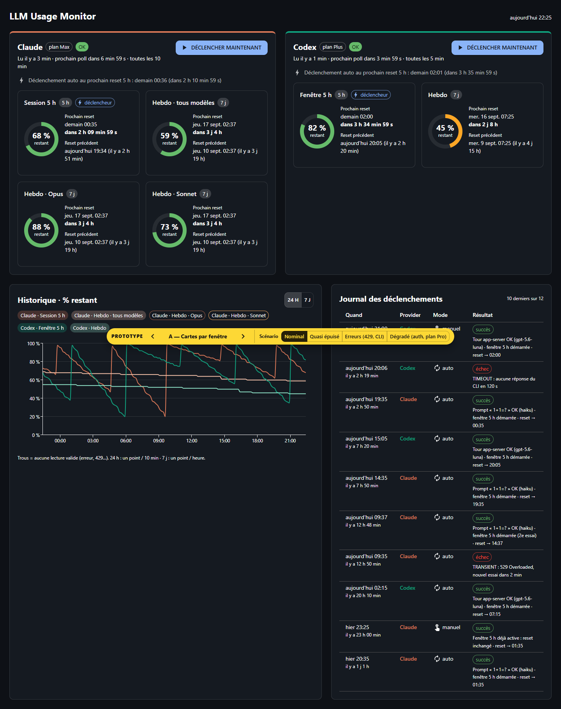
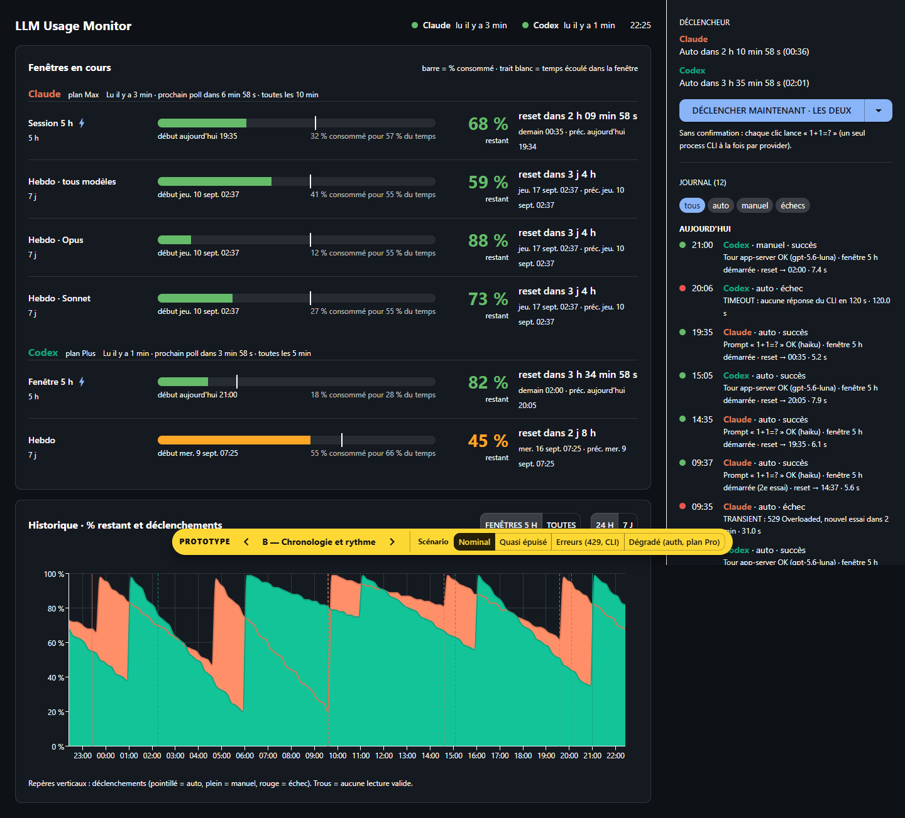
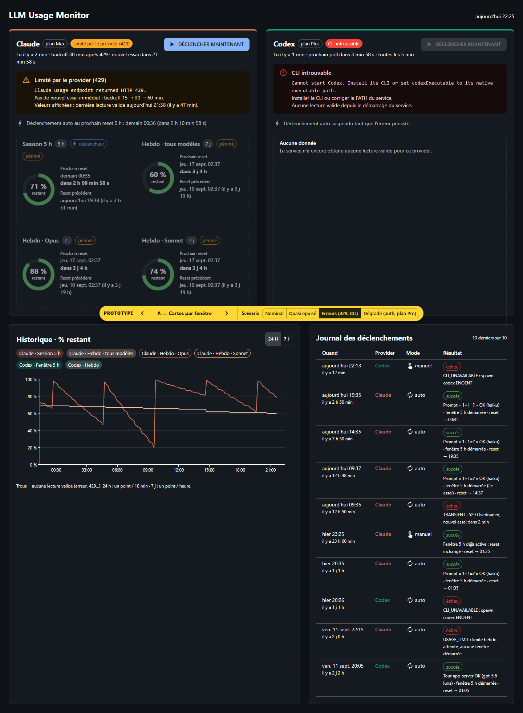
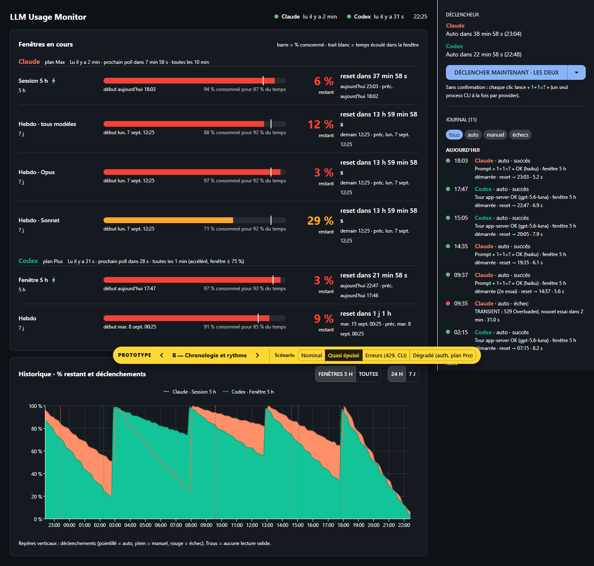
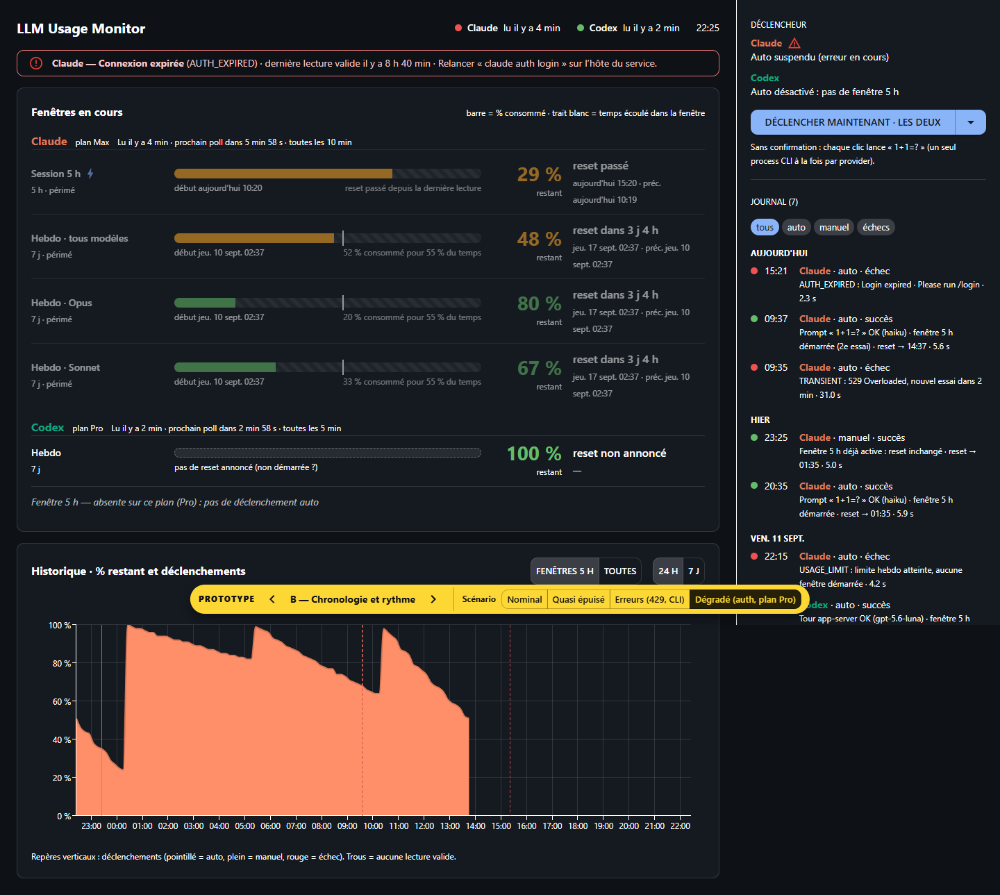

# PROTOTYPE jetable — UX du dashboard (#7)

> Prototype **jetable** pour le ticket [#7](https://github.com/Elyspio/llm-usage-monitor/issues/7) (map [#1](https://github.com/Elyspio/llm-usage-monitor/issues/1)).
> Il sert uniquement à réagir à une maquette : données mock, aucun backend, aucune auth. Il vit sur la branche `prototype/dashboard-ux` et ne doit **pas** être mergé dans `main` ; seule la décision prise sera reportée.

## Lancer

```sh
cd prototypes/dashboard
pnpm install
pnpm dev          # http://localhost:5174
```

- `pnpm build` : type-check (`tsc`) + build Vite.
- `pnpm shots` : régénère les captures `screenshot-*.png` (Playwright + serveur de dev).

Pilotage :

- **Barre jaune flottante** en bas de l'écran : variante (flèches, ou touches ← / →) et scénario mock.
- Paramètres d'URL partageables : `?variant=A|B&scenario=nominal|quasi-epuise|erreurs|degrade`.
- Les horloges partent du chargement de la page. Recharger pour remettre les comptes à rebours à zéro.
- Le bouton « Déclencher maintenant » est un stub : il ajoute une ligne « en cours » au journal, puis succès ou échec après 1,8 s selon le scénario. Il ne relit pas l'usage.

Stack : React 19.3, Vite 8.3 (Vite+ non utilisé), `@mui/material` 9.4, `@mui/x-charts` 9.13. Les types viennent directement de `src/shared.ts` (`UsageResult`, `UsageWindow`). `ProviderView` (dans `src/mock.ts`) est une **hypothèse** de ce que le backend exposerait en plus :

- la dernière lecture valide ;
- le reset précédent ;
- le backoff ;
- la fenêtre du déclencheur ;
- le prochain déclenchement auto.

## Scénarios

| Scénario | Ce qu'il montre |
| --- | --- |
| Nominal | Claude (5 h + hebdo tous modèles / Opus / Sonnet) et Codex (5 h + hebdo), polls à 10 min et 5 min. |
| Quasi épuisé | Fenêtres entre 3 et 12 % restants, rythme de consommation élevé. Le poll Codex passe à 1 min (fenêtre ≥ 75 %, comme le TUI officiel). |
| Erreurs (429, CLI) | Claude `RATE_LIMITED` : backoff de 30 min et dernière lecture valide vieille de 47 min, affichée « périmée ». Codex `CLI_UNAVAILABLE`, sans aucune lecture valide. |
| Dégradé (auth, plan Pro) | Claude `AUTH_EXPIRED` : lecture valide vieille de 8 h 40, reset 5 h annoncé déjà passé, déclenchement auto suspendu. Codex sur plan Pro : **pas de fenêtre 5 h** (#4), donc pas de déclenchement auto, et hebdo **sans `resetsAt`** (non démarrée ?). |

## Variantes

### A — Cartes par fenêtre (état instantané)

- Une colonne par provider, avec l'état du poll et un bouton « Déclencher maintenant » par provider.
- Une carte par fenêtre : jauge circulaire du % restant, prochain reset avec compte à rebours, reset précédent, durée, badge « déclencheur » sur la fenêtre 5 h.
- Erreurs en `Alert` dans la colonne du provider. Les valeurs périmées sont grisées et en pointillés.
- Historique : graphe filtrable par puces (24 h / 7 j).
- Journal : tableau des 10 derniers déclenchements.
- Déclenchement **avec confirmation**, qui explique l'effet (nouvelle fenêtre 5 h, ou fenêtre déjà active). Le bouton est **désactivé** quand l'échec est certain (`AUTH_EXPIRED`, `CLI_UNAVAILABLE`).

Question explorée : « Où en suis-je, là, maintenant ? »

### B — Chronologie et rythme (lecture temporelle)

- Bandeau d'incidents global en haut de page.
- Une ligne par fenêtre : barre du % consommé, avec un trait pour le **temps écoulé** dans la fenêtre. La barre affiche le rythme, par exemple « 94 % consommé pour 87 % du temps · rythme élevé ». La ligne donne aussi le % restant en gros, le compte à rebours, et le début de fenêtre en plus du reset précédent.
- Historique : grand graphe avec les **déclenchements en repères verticaux** (auto / manuel / échec).
- Panneau latéral fixe « Déclencheur » :
  - prochains déclenchements auto ;
  - split-button « Déclencher maintenant · Claude / Codex / les deux », **sans confirmation et jamais désactivé** (l'échec est visible dans le journal) ;
  - journal **complet**, filtrable (tous / auto / manuel / échecs) et groupé par jour.

Question explorée : « Vais-je tenir jusqu'au reset, et le déclencheur fait-il son travail ? »

## Captures







Les captures sont en pleine page. Le panneau latéral de B est `sticky` (hauteur de la fenêtre), il apparaît donc tronqué sur les captures.

## Questions ouvertes (à trancher en réagissant)

1. **Variante** : A (état instantané en cartes), B (chronologie et rythme), ou un mélange ? Par exemple, les cartes de A avec la barre « consommé vs temps écoulé » de B.
2. **Fenêtres affichées** : toutes (hebdo Opus / Sonnet compris), ou seulement la 5 h et l'hebdo « tous modèles » par défaut, avec les autres repliées ? Et la fenêtre 5 h, qui porte le déclencheur, doit-elle dominer visuellement ?
3. **« Reset précédent »** : reset **observé** dans l'historique (utile pour voir le temps perdu entre un reset et le redémarrage de la fenêtre), ou simple **début de fenêtre** (`resetsAt − durée`) ? B montre les deux.
4. **Historique** : 24 h et 7 j suffisent-ils ? Quelle granularité (un point par poll, ou agrégé à 10 min / 1 h) ? Quelle rétention ? Cela alimente le ticket rétention et agrégation.
5. **Journal des déclenchements** : 10 dernières lignes (A) ou journal complet filtrable (B) ? Quels détails garder (durée, reset confirmé après relecture, message d'erreur brut) ? Faut-il des repères de déclenchement sur le graphe ?
6. **Bouton « Déclencher maintenant »** : trois choix à faire.
   - Avec confirmation (A) ou direct (B) ?
   - Désactivé quand l'échec est certain (A), ou autorisé avec l'échec journalisé (B) ?
   - La cible « les deux » est-elle utile ?
   - Et que faire quand la fenêtre 5 h est déjà active ?
7. **États dégradés** : faut-il afficher les valeurs périmées, grisées avec leur âge, sans limite de durée ? Ou les masquer au-delà d'un seuil (par exemple 1 h, ou dès que le `resetsAt` affiché est passé) ? Faut-il montrer le message d'erreur brut (anglais) ou seulement le libellé traduit et l'action à faire ?
8. **Rythme et alertes** : l'indicateur « consommé vs temps écoulé » est-il utile ? Seuils de couleur : ≥ 50 % vert, ≥ 20 % orange, sinon rouge. Ces seuils doivent-ils aussi déclencher les notifications ?
